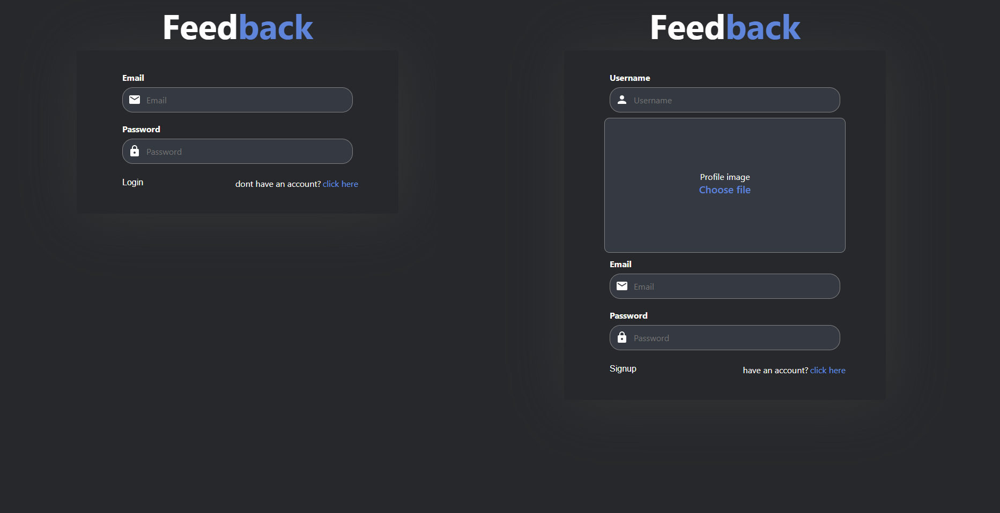
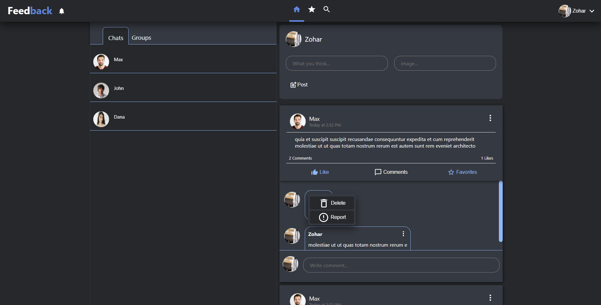
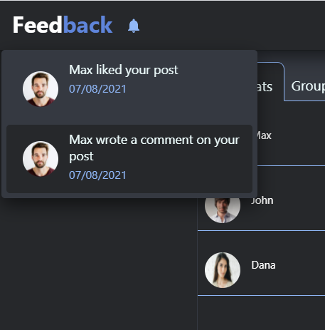
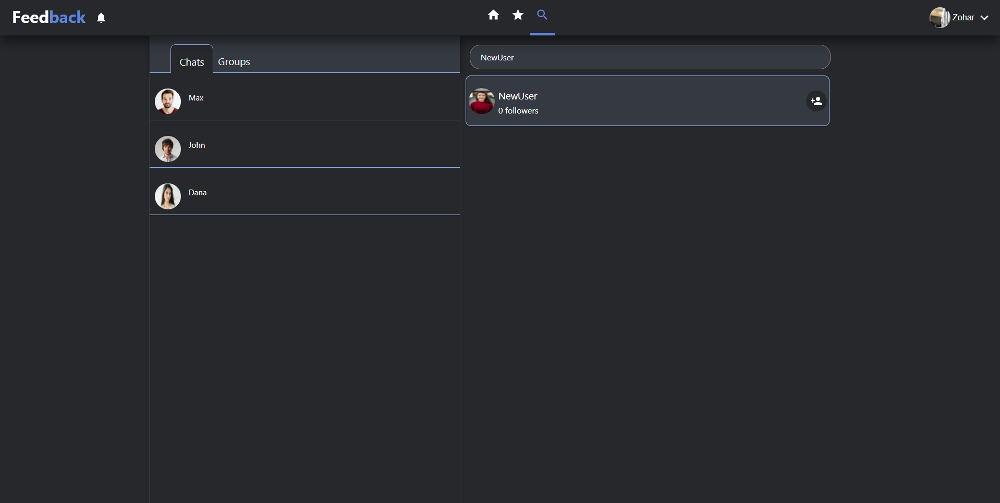
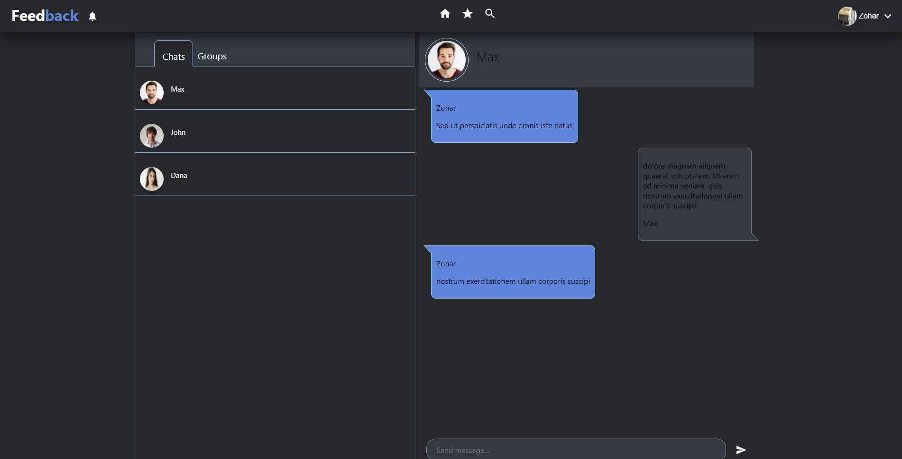
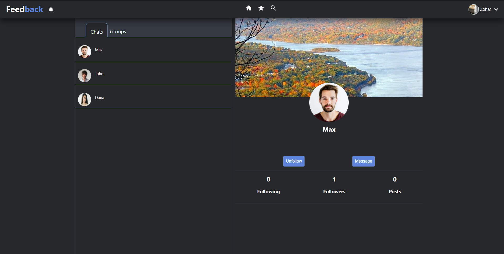
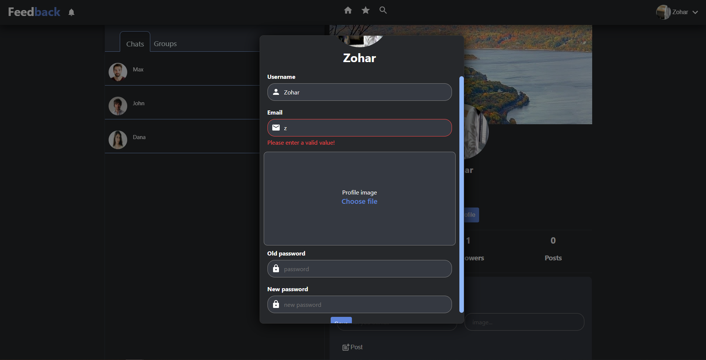

## Street Shop

> Social-mdia platform built with MERN stack.

Live: https://feedbackmernstack.herokuapp.com/










## Technologies & Tools

### Front-end:

- React
- Redux
- CSS
- react-router-dom
- socket.io-client

### Backend:

- Node/Express
- MongoDB/Mongoose
- jwt
- multer
- socket-io


## Features

 - register and login users. 
 - Profile images can be uploaded using file system.
 - search other users by username. 
 - save any post to favorites.
 - favorites posts page.
 - delete posts.
 - comments on post.
 - like to post.
 - notifications.
 - profile page.
 - edit profile page user data.
 - password is stored in database in encrypted format with salt.
 - create and edit posts.
 - posts include text(caption) and image(s).
 - profile page shows user details and posts with following and followers menu.
 - chat built with socket.io


## Usage

### Env Variables

Create a .env file in the backend folder and add the following

```
MONGODB_URI = your mongodb uri
JWT_SECRET = 'abc123'
CLOUDINARY_CLOUD_NAME = your cloudinary cloud name
CLOUDINARY_KEY = your cloudinary key
CLOUDINARY_SECRET_API = your cloudinary secret api key
```

### Install Dependencies (frontend & backend)

```
cd frontend
npm install
cd ../backend
npm install
```

### Run

#### backend
```
# Run on port :8080
node server.js
```
#### frontend
```
# Run on port :3000
npm start
```
